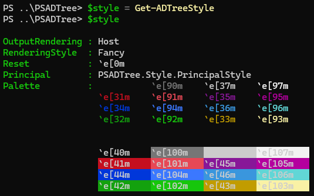
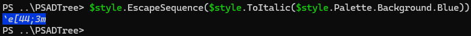
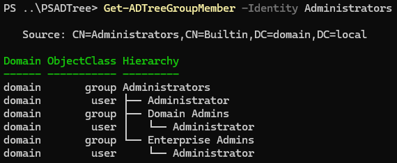
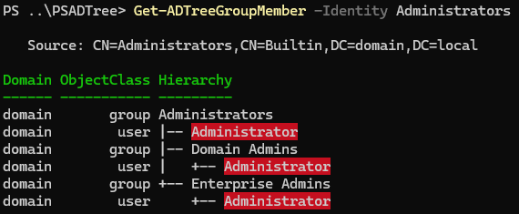

# about_TreeStyle

## TOPIC

Customizing PSADTree Output with TreeStyle.

## SHORT DESCRIPTION

The `TreeStyle` class enables customization of the hierarchical output for `Get-ADTreeGroupMember` and `Get-ADTreePrincipalGroupMembership` cmdlets in the PSADTree module.

## LONG DESCRIPTION

PSADTree version 1.3.0 and later introduces support for coloring the hierarchical output of the `Get-ADTreeGroupMember` and `Get-ADTreePrincipalGroupMembership` cmdlets using the `TreeStyle` class. This class provides a subset of features similar to those in PowerShell’s built-in [PSStyle][1].
You can access the singleton instance of `TreeStyle` through either the [Get-ADTreeStyle][2] cmdlet or the `[PSADTree.Style.TreeStyle]::Instance` property:

<div>
  &nbsp;&nbsp;&nbsp;
  
</div>

The `TreeStyle` class offers methods for combining escape sequences and applying text accents, such as bold or italic. See the next section for additional details.

Here are its members:

```powershell
   TypeName: PSADTree.Style.TreeStyle

Name            MemberType Definition
----            ---------- ----------
CombineSequence Method     string CombineSequence(string left, string right)
Equals          Method     bool Equals(System.Object obj)
EscapeSequence  Method     string EscapeSequence(string vt)
GetHashCode     Method     int GetHashCode()
GetType         Method     type GetType()
ResetSettings   Method     void ResetSettings()
ToBold          Method     string ToBold(string vt)
ToItalic        Method     string ToItalic(string vt)
ToString        Method     string ToString()
OutputRendering Property   PSADTree.Style.OutputRendering OutputRendering {get;set;}
Palette         Property   PSADTree.Style.Palette Palette {get;}
Principal       Property   PSADTree.Style.PrincipalStyle Principal {get;}
RenderingStyle  Property   PSADTree.Style.RenderingStyle RenderingStyle {get;set;}
Reset           Property   string Reset {get;}
```

The `.EscapeSequence()` method reveals the escape sequence applied to generate specific colors or accents. For example:

<div>
  &nbsp;&nbsp;&nbsp;
  
</div>

## CUSTOMIZING OUTPUT

You can customize the output by modifying the properties of the `TreeStyle` class, much like you would with PowerShell’s `PSStyle`. This allows you to update colors for computers, groups, and users, as well as the circular and processed tags.

Consider the standard output of `Get-ADTreeGroupMember`:

<div>
  &nbsp;&nbsp;&nbsp;
  
</div>

You can adjust the appearance by modifying the `PSADTree.Style.TreeStyle` object. Here’s an example of how to apply customizations:

```powershell
$style = Get-ADTreeStyle
$palette = $style.Palette

# Update users to white text on a red background
$style.Principal.User = $style.CombineSequence($palette.Foreground.White, $palette.Background.Red)

# Change the rendering style to use ASCII
$style.RenderingStyle = 'Classic'
```

> [!TIP]
>
> - PowerShell 6 and later support the `` `e `` escape character for VT sequences. For __Windows PowerShell 5.1__, use `[char] 27` instead. For example, replace ``"`e[45m"`` with `"$([char] 27)[45m"`. See [about_Special_Characters][3] for more details.
> - The `TreeStyle` class provides methods like `.ToItalic()`, `.ToBold()`, and `.CombineSequence()` to apply text accents or combine VT sequences.
> - To reset the `TreeStyle` instance to its default state, use `.ResetSettings()`. If stored in a variable, reassign it afterward, e.g., `$style.ResetSettings()` followed by `$style = Get-ADTreeStyle`.

After applying these changes, re-running the same `Get-ADTreeGroupMember` command will display the updated styles:

<div>
  &nbsp;&nbsp;&nbsp;
  
</div>

## DISABLING ANSI OUTPUT

Just like PowerShell’s `PSStyle`, you can disable ANSI rendering in PSADTree’s output by modifying the `.OutputRendering` property of the `TreeStyle` instance. Simply set it to `'PlainText'` using the following command:

```powershell
(Get-ADTreeStyle).OutputRendering = 'PlainText'
```

This disables all ANSI-based coloring and formatting, resulting in plain text output for commands like `Get-ADTreeGroupMember` and `Get-ADTreePrincipalGroupMembership`. It’s a straightforward way to simplify the display when you don’t need the extra visual styling.

[1]: https://learn.microsoft.com/en-us/powershell/module/microsoft.powershell.core/about/about_ansi_terminals
[2]: ./Get-ADTreeStyle.md
[3]: https://learn.microsoft.com/en-us/powershell/module/microsoft.powershell.core/about/about_special_characters?view=powershell-7.4
